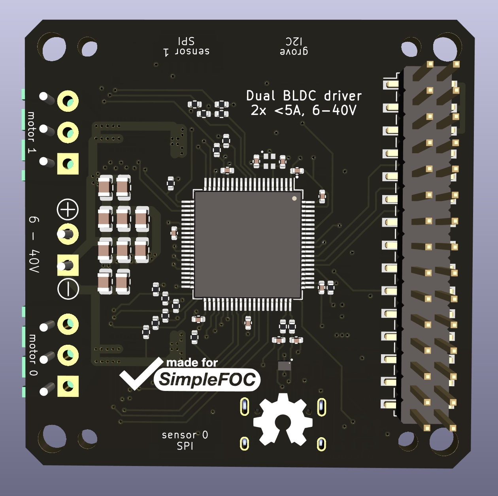
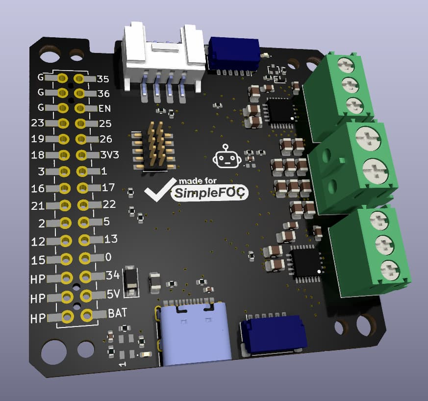
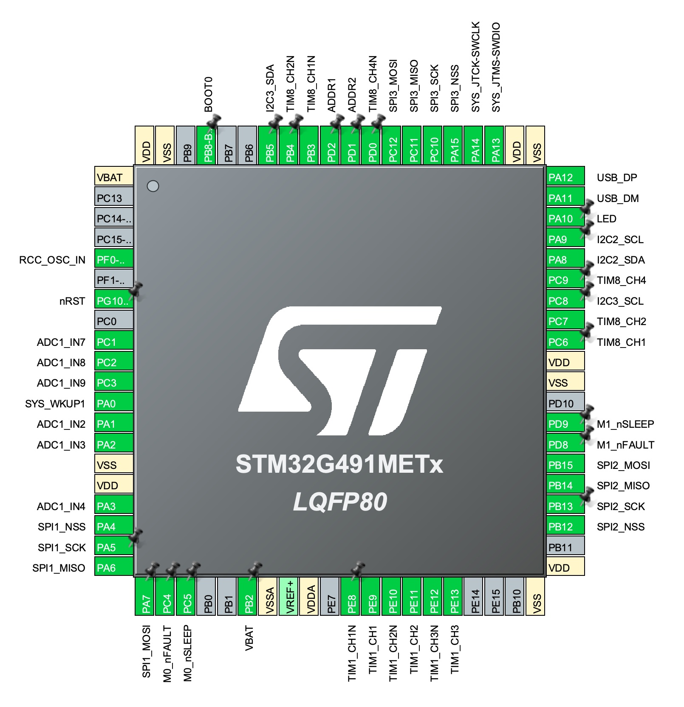

# Rosmo ESC

Design for [Rosmo](https://rosmo.io) ESC - in M5Stack format.

[Schematic (PDF)](./Rosmo_ESC.pdf)

Top:

Bottom:

## Features

* Dual brushless motor ESC in M5-Stack module format
* Drives 2x 3-phase BLDC motors with up to 40V and 5A (cooling needed - to be tested)
* 2x SPI sensors supported, such as MA732, MA730, AS5048A, AS5047, etc...
* Control inputs via SPI, I2C    (and GPIO:question:)
* Grove port for I2C input/output

## Status

:warning: In development, prototype boards on order.

At the moment, schematic is complete and board has been routed. The BOM is complete but my have to change due to component availability.

**Do not use this for anything yet!**

## Pinout

Prototype pinout, based on STM32G491MET6, which is probably not the final MCU for this design, but a suitable (if maybe overpowered and therefore expensive) one that was available in the current semiconductor shortage. This MCU is 12x12mm LQFP-80, which is more than enough pins.

Functionality supported by this pinout:

* 2x 3-phase BLDC motor control with 6 PWM (6 outputs on TIM1 and 6 on TIM8, in CHx/CHxN configuration)
* 2x nSLEEP outputs (GPIO)
* 2x nFAULT inputs (interrupt GPIO)
* 2x 3-phase low-side current sensing (6 single-ended inputs on ADC1)
* 1x battery voltage monitor (1 single-ended input on ADC2)
* 3x SPI w/ hardware NSS pin (2 sensor ports + M5 stack SPI pins)
* 2x I2C (grove port + M5 stack SPI)
* USB FS connected to USB-C port (should allow serial monitor function and DFU firmware flashing)
* WAKE input (M5 GPIO connected to system wake 1, so M5 ESP32 can wake STM32 from sleep)
* SWD debug pins connected to standard ARM-10 debug header
* LED pin connected to status LED (or NeoPixel LED)
* BOOT0, nRST, OSC_IN - STM32 system pins

## Dependencies

The design uses various custom symbols and footprints. They should load from the project-internal cache when you open the project. If they do not, you can find [a kicad library](https://github.com/runger1101001/kicad-lib-runger) here which contains all the symbols/footprints used, among others.

Uses KiCad 6.
